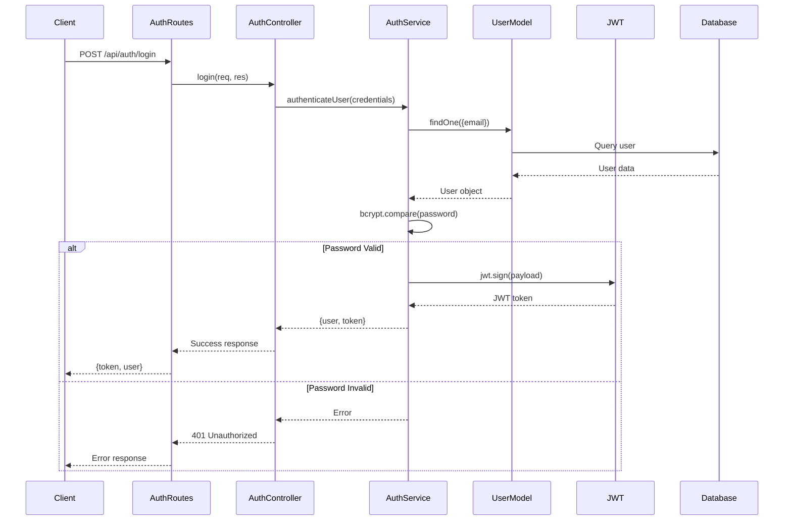
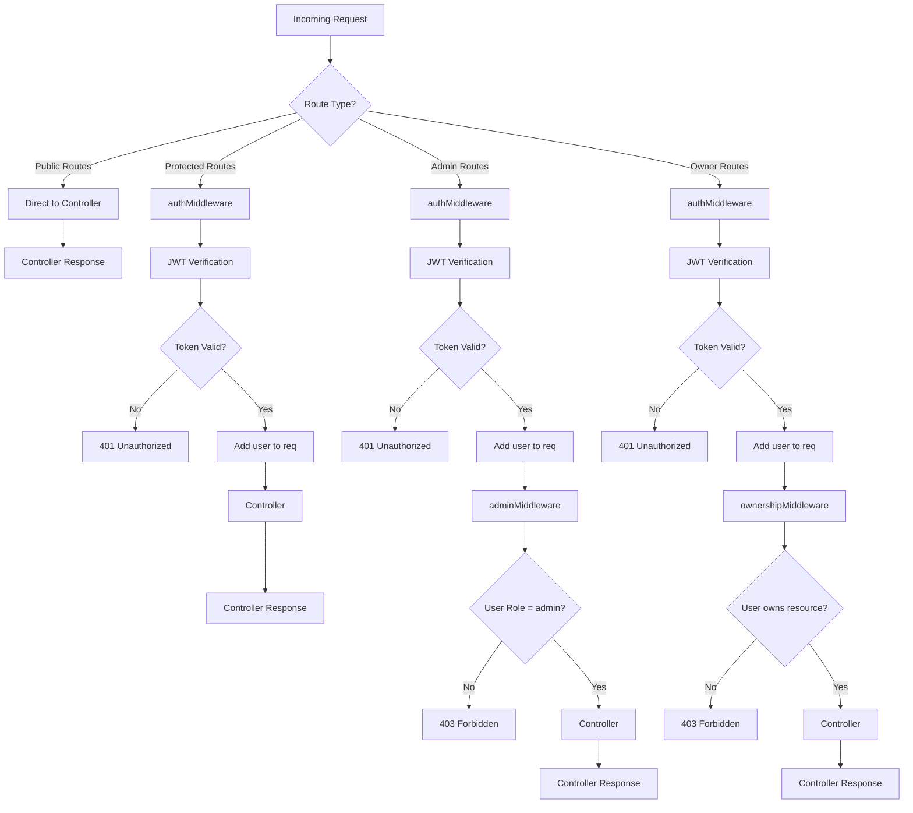
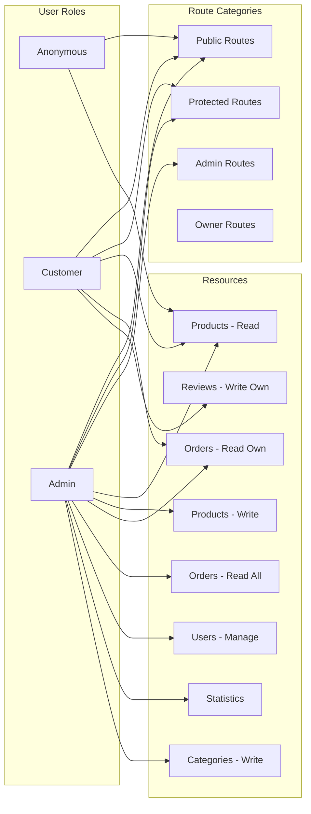

# Authentication & Permission System Diagrams

## 1. Authentication Flow Diagram



## 2. Middleware Chain Architecture



## 3. Permission Matrix



## 4. Detailed Route Permissions

### Authentication Routes (`/api/auth`)
- **POST /login** - Public ✅
- **POST /register** - Public ✅
- **POST /logout** - Protected (any authenticated user) 🔐
- **GET /me** - Protected (any authenticated user) 🔐

### Product Routes (`/api/products`)
- **GET /** - Public ✅
- **GET /:id** - Public ✅
- **POST /** - Admin only 👑
- **PUT /:id** - Admin only 👑
- **DELETE /:id** - Admin only 👑

### Order Routes (`/api/orders`)
- **GET /** - Admin (all orders) 👑 / User (own orders) 🔐👤
- **GET /:id** - Admin 👑 / Owner 👤
- **POST /** - Protected 🔐
- **PUT /:id** - Admin 👑 / Owner 👤
- **DELETE /:id** - Admin only 👑

### User Routes (`/api/users`)
- **GET /** - Admin only 👑
- **GET /:id** - Admin 👑 / Owner 👤
- **PUT /:id** - Admin 👑 / Owner 👤
- **DELETE /:id** - Admin only 👑

### Category Routes (`/api/categories`)
- **GET /** - Public ✅
- **GET /:id** - Public ✅
- **POST /** - Admin only 👑
- **PUT /:id** - Admin only 👑
- **DELETE /:id** - Admin only 👑

### Statistics Routes (`/api/statistics`)
- **GET /dashboard** - Admin only 👑
- **GET /revenue** - Admin only 👑
- **GET /orders** - Admin only 👑
- **GET /products** - Admin only 👑

## 5. Security Implementation Details

### JWT Token Structure
```json
{
  "payload": {
    "userId": "ObjectId",
    "email": "user@example.com",
    "role": "customer|admin",
    "iat": 1234567890,
    "exp": 1234567890
  }
}
```

### Password Security
- **Hashing**: bcrypt with salt rounds
- **Verification**: bcrypt.compare()
- **Storage**: Never store plain passwords

### Error Handling
- **401 Unauthorized**: Invalid/missing token
- **403 Forbidden**: Insufficient permissions
- **404 Not Found**: Resource not exists
- **AppError**: Centralized error handling

## 6. Middleware Execution Order

```
Request → Route Handler → Middleware Chain → Controller
                    ↓
1. authMiddleware (if protected)
2. adminMiddleware (if admin required)
3. ownershipMiddleware (if ownership required)
4. validateObjectId (if ID validation needed)
5. Controller function
```

## Legend
- ✅ Public access
- 🔐 Requires authentication
- 👑 Requires admin role
- 👤 Requires resource ownership
- 🔐👤 Requires auth + ownership check
